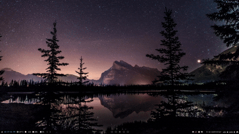

<div align="center">
  <h1>LSR</h1>
  <p>
    
    
    
  </p>
  <p><em>A tiny <code>ls</code> clone in Rust that makes files pretty with colors 🎨</em></p>
  <div align="center">
  <p>Made with ❤️ and ☕</p>
  </div>
  

</div>

---

## What it does

Just like `ls` but with colors for different file types. Because why should terminals be boring?

- Files get colors based on their extensions (`.rs` = red, `.js` = yellow, etc.)
- Directories get a blue `/`
- Shows Unix permissions and timestamps
- That's it!

## 🚀 Install

```bash
git clone <your-repo>
cd lsr
cargo install --path .
lsr
```

Need Rust? Get it from [rustup.rs](https://rustup.rs/)

## 🎨 Colors

| What | Color |
|------|-------|
| Rust files | 🔴 Red |
| JavaScript | 🟡 Yellow |
| Python | 🟢 Green |
| Go | 🔵 Blue |
| Directories | 🔵 Blue with `/` |
| Everything else | ⚪ White |

(and like 30 other file types)

## 🤷 Why?

Learning Rust + wanted prettier file listings. Made this in like 2 hours.

## 📄 License

MIT or whatever, it's just a learning project
